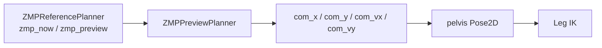

# CoM Planner 技术详解

> [!summary]
> 当前工程里的 `zmp_preview.py` 不是教科书式的完整 preview controller，而是一个：
> **基于 ZMP 当前值和一步预览值的、带速度/加速度限幅的简化 CoM 跟踪器。**

---

## 0. 本篇函数速查

| 函数 / 类 | 来源文件 | 本篇解释位置 | 相关跳转 |
|---|---|---|---|
| `ZMPPreviewController.update()` | `zmp_preview.py` | [[com_planner_notes#4. 核心代码先贴出来|第 4 节]] | 上游：[[zmp_reference_notes#8. `preview_zmp()` 在当前实现里有多“preview”|ZMP preview]] |
| `ZMPReferencePlanner.zmp_for_state()` | `zmp_reference.py` | [[zmp_reference_notes#6. 数学上它在做什么|ZMP 当前参考]] | 不是本文件函数，但它提供 `zmp_now` |
| `ZMPReferencePlanner.preview_zmp()` | `zmp_reference.py` | [[zmp_reference_notes#8. `preview_zmp()` 在当前实现里有多“preview”|ZMP 预览参考]] | 不是本文件函数，但它提供 `zmp_preview` |
| `WalkerController._rate_limit()` | `main.py` | [[asimo_walker_code_reading_guide#8.9 第九步：并不是直接发布，还要过几道工程安全层|主线 8.9]] | CoM 平滑之后，关节命令还会再限速 |
| `LegIK.solve()` | `leg_ik.py` | [[leg_ik_notes#4. 先看核心代码|Leg IK]] | CoM 结果会作为 pelvis pose 的一部分进入 IK |

---

## 1. 它在整条链路中的角色

`zmp_reference.py` 告诉系统：

```text
重心应该压向哪里
```

但这还不够，因为身体不能瞬移。

`zmp_preview.py` 负责补上的就是：

```text
身体如何以平滑、有限速、有限加速度的方式跟过去
```

在主循环中：

```python
com_x, com_y, com_vx, com_vy, _, _ = self.com.update(self.dt, zmp_now, zmp_preview)
```

随后这个结果会直接进入骨盆目标 pose：

```python
pelvis = Pose2D(
    com_x,
    com_y,
    self.params.pelvis_height,
    roll * 0.25,
    pitch * 0.25,
    pelvis_yaw,
)
```

所以当前工程里：

> `CoM planner` 输出的其实就是**骨盆平移参考**的核心部分。

---

## 2. 模块在系统中的位置



模块边界非常清楚：

- 上游：ZMP 参考
- 下游：骨盆目标位姿，最终交给 IK

---

## 3. 当前代码的内部状态

先看类成员：

```python
self.com_x = 0.0
self.com_y = 0.0
self.vx = 0.0
self.vy = 0.0
self.ax = 0.0
self.ay = 0.0
self.initialized = False
```

这说明当前 CoM planner 不是无状态函数，而是一个离散时间积分器：

- 保持位置状态
- 保持速度状态
- 保持上一帧加速度命令

这也是为什么每次切 profile 时都要：

```python
self.com.reset(self.params, 0.0, 0.0)
```

---

## 4. 核心代码先贴出来

```python
def update(self, dt: float, zmp_now: tuple, zmp_preview: tuple) -> tuple:
    if not self.initialized:
        self.reset(self.params, zmp_now[0], zmp_now[1])

    p = self.params
    horizon = max(0.2, p.zmp_preview_time)
    target_x = 0.72 * zmp_now[0] + 0.28 * zmp_preview[0]
    target_y = 0.78 * zmp_now[1] + 0.22 * zmp_preview[1]

    omega2 = G / max(0.25, p.pelvis_height)
    ax_cmd = p.zmp_kp * omega2 * (target_x - self.com_x) - p.zmp_kd * self.vx / horizon
    ay_cmd = p.zmp_kp * omega2 * (target_y - self.com_y) - p.zmp_kd * self.vy / horizon
    ax_cmd = clamp(ax_cmd, -p.max_com_accel, p.max_com_accel)
    ay_cmd = clamp(ay_cmd, -p.max_com_accel, p.max_com_accel)

    self.vx = clamp(self.vx + ax_cmd * dt, -p.max_com_speed, p.max_com_speed)
    self.vy = clamp(self.vy + ay_cmd * dt, -p.max_com_speed, p.max_com_speed)
    self.com_x += self.vx * dt
    self.com_y += self.vy * dt
    self.ax = ax_cmd
    self.ay = ay_cmd
    return self.com_x, self.com_y, self.vx, self.vy, self.ax, self.ay
```

---

## 5. 用控制观点拆开它

这段代码可以拆成 5 层。

### 5.1 先合成一个“当前想靠近的目标”

```python
target_x = 0.72 * zmp_now[0] + 0.28 * zmp_preview[0]
target_y = 0.78 * zmp_now[1] + 0.22 * zmp_preview[1]
```

数学上是：

$$
x_t = 0.72\,x_{zmp}^{now} + 0.28\,x_{zmp}^{preview}
$$

$$
y_t = 0.78\,y_{zmp}^{now} + 0.22\,y_{zmp}^{preview}
$$

### 这表示什么

它没有只盯当前支撑参考，而是给了下一步一点权重。

所以它在工程上属于：

```text
当前参考为主
下一步趋势为辅
```

这就是当前代码里的“preview”含义。

---

### 5.2 用一个倒立摆风格的近似系数

```python
omega2 = G / max(0.25, p.pelvis_height)
```

对应：

$$
\omega^2 = \frac{g}{h}
$$

其中：

- $g$ 是重力加速度
- $h$ 是骨盆高度近似下的倒立摆高度

### 这层的物理直觉

如果把机器人在 sagittal / lateral 小范围平移里近似成 LIPM：

- CoM 越高，摆越“慢”
- CoM 越低，摆越“紧”

所以 `pelvis_height` 不只是 IK 几何参数，它还直接影响 CoM 动力学响应。

---

### 5.3 用位置误差和速度项算期望加速度

```python
ax_cmd = p.zmp_kp * omega2 * (target_x - self.com_x) - p.zmp_kd * self.vx / horizon
ay_cmd = p.zmp_kp * omega2 * (target_y - self.com_y) - p.zmp_kd * self.vy / horizon
```

可以写成：

$$
a_x = k_p \omega^2 (x_t - x_{com}) - k_d \frac{v_x}{T_h}
$$

$$
a_y = k_p \omega^2 (y_t - y_{com}) - k_d \frac{v_y}{T_h}
$$

其中：

- $k_p = \text{zmp\_kp}$
- $k_d = \text{zmp\_kd}$
- $T_h = \max(0.2,\ \text{zmp\_preview\_time})$

### 这本质上是什么控制器

你可以把它近似理解成一个：

```text
面向 ZMP 参考的、带阻尼项的二阶平移跟踪器
```

它不是严格的全状态 LQR / MPC，但对当前这类保守步态已经够清楚、够稳。

---

### 5.4 然后加速度和速度都要限幅

```python
ax_cmd = clamp(ax_cmd, -p.max_com_accel, p.max_com_accel)
ay_cmd = clamp(ay_cmd, -p.max_com_accel, p.max_com_accel)

self.vx = clamp(self.vx + ax_cmd * dt, -p.max_com_speed, p.max_com_speed)
self.vy = clamp(self.vy + ay_cmd * dt, -p.max_com_speed, p.max_com_speed)
```

### 为什么这一步特别重要

如果只有理论加速度公式，没有限幅：

- 重心会响应过猛
- IK 输出会跟着突然变化
- 关节补偿和单脚支撑都会更难兜住

所以当前实现不是“追得越快越好”，而是：

> **优先保证 CoM 命令平滑、保守、可执行。**

---

### 5.5 最后通过积分更新位置

```python
self.com_x += self.vx * dt
self.com_y += self.vy * dt
```

这说明当前 CoM planner 是一个离散积分系统，而不是解析解。

这种写法优点很明显：

- 简单
- 易调
- 很适合和状态机、限幅、稳定器一起做工程落地

---

## 6. 为什么当前实现叫 `preview`，但又不是论文版 preview control

如果你从学术严格性来问：

### 它不像完整 preview control 的地方

- 没有长时域离散参考序列
- 没有显式 Riccati / LQR 形式
- 没有把系统状态堆成一个完整预测优化问题

### 它保留了 preview 精神的地方

- 当前目标不只看 `zmp_now`
- 还看了一步的 `zmp_preview`
- 让 CoM 在当前相位中带一点前瞻性，而不是纯粹滞后跟随

所以更准确地说：

> 当前 `zmp_preview.py` 是一个**带一步前瞻的简化 LIPM 风格 CoM 跟踪器**。

---

## 7. 它和 `pelvis` 目标位姿之间的关系

在主循环里，CoM planner 的输出没有直接叫 “com pose”，而是被塞进了骨盆：

```python
pelvis = Pose2D(
    com_x,
    com_y,
    self.params.pelvis_height,
    roll * 0.25,
    pitch * 0.25,
    pelvis_yaw,
)
```

这其实非常重要。

### 工程意义

当前工程不是显式区分：

- 一个单独的质心点控制器
- 一个单独的骨盆姿态控制器

而是把 `com_x/com_y` 直接当作**骨盆平移参考**的一部分。

于是：

- `zmp_preview.py` 给出身体平移轨迹
- `main.py` 给骨盆再加一点姿态倾斜补偿
- `leg_ik.py` 最终把这个骨盆位姿转成腿关节

所以在当前代码里：

> `CoM planner` 的输出，其实是 **pelvis target 的平移核心**。

---

## 8. 为什么 walking 会显得平滑，而不是一格一格跳

这不是某一个模块单独做到的，而是几层叠起来：

### 8.1 `zmp_reference`

给了连续相位下平滑插值的参考点。

### 8.2 `zmp_preview`

用速度和加速度限幅把参考变成平滑的 `com_x/com_y`。

### 8.3 `leg_ik`

把平滑骨盆和脚位姿变成平滑的关节角趋势。

### 8.4 `_rate_limit`

进一步把每帧关节变化做了限速。

所以“平滑”其实是：

```text
参考平滑
+ CoM 动力学平滑
+ 关节级限速平滑
```

---

## 9. 参数在这个模块里的真实控制意义

### `zmp_kp`

增大后：

- 更积极地追目标 ZMP 参考
- CoM 反应更快
- 但更容易带来晃动或 overshoot

### `zmp_kd`

增大后：

- 阻尼更强
- CoM 更不容易来回摆
- 但太大可能会显得迟钝

### `zmp_preview_time`

当前代码里它不直接决定长时域预测，而更多像阻尼项中的时间尺度。

### `pelvis_height`

同时影响：

1. IK 里腿要伸多长
2. CoM planner 里的 $\omega^2 = g/h$

所以这是个双重重要参数。

### `max_com_speed`

限制 CoM 平移速度上限。

### `max_com_accel`

限制 CoM 平移加速度上限。

> [!tip]
> 真正影响“平滑感”的，往往不只是 `zmp_kp/zmp_kd`，而是这两个限幅参数。

---

## 10. 这个实现的优点

### 10.1 非常容易解释

你一眼就能看懂：

- 目标怎么来
- 加速度怎么来
- 限幅怎么做
- 积分怎么做

### 10.2 和保守 walking 很匹配

当前项目追求的是稳健、保守、易调，而不是论文级最优性能。

### 10.3 对工程调参很友好

各个参数的作用方向比较直观。

---

## 11. 这个实现的局限

### 11.1 不是真正的 full preview controller

这一点一定要讲清楚，否则会误以为代码已经实现了完整 Kajita preview control。

### 11.2 只在平面上处理 CoM

当前只规划：

- `com_x`
- `com_y`

没有显式处理可变高度 CoM。

### 11.3 动力学建模很轻

它依赖的是一个非常简化的 LIPM 风格近似，不包含更完整的人体动力学和接触约束。

---

## 12. 如果你调这个模块，最该先看什么现象

### 现象 1：机器人左右晃但不敢迈

优先怀疑：

- `zmp_kp` 偏小
- `support_zmp_margin` 偏小
- `transfer_time` 偏短或不合适

### 现象 2：机器人重心走得太猛，IK 跟不上

优先怀疑：

- `zmp_kp` 偏大
- `max_com_speed` 偏大
- `max_com_accel` 偏大

### 现象 3：步态有点“糯”，不愿意往前进

优先怀疑：

- `max_com_speed` 过保守
- `max_com_accel` 过保守
- `zmp_kd` 太大导致阻尼过重

---

## 13. 一句话收尾

当前 `zmp_preview.py` 的技术本质可以概括成一句话：

> **用一个带一步前瞻、带阻尼、带速度/加速度限幅的简化 CoM 跟踪器，把离散步态相位上的 ZMP 支撑参考变成平滑的骨盆平移轨迹。**
