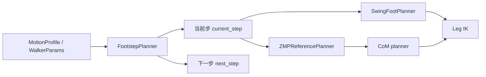
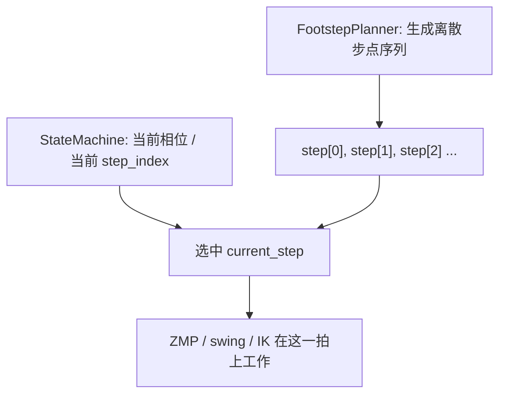

# Footstep Planner 技术详解

> [!summary]
> `footstep_planner.py` 在当前工程里只做一件事：
> **生成左右脚交替的理论落脚点序列。**
>
> 它不负责重心怎么跟，不负责脚在空中怎么走，也不负责关节角怎么解。

---

## 0. 本篇函数速查

| 函数 / 类 | 来源文件 | 本篇解释位置 | 相关跳转 |
|---|---|---|---|
| `FootstepPlanner._append_next_step()` | `footstep_planner.py` | [[footstep_planner_notes#4. 核心代码怎么生成步点|第 4 节]] | 上游：[[asimo_walker_code_reading_guide#8.2 第二步：拿到当前这一步和下一步的足步目标|主循环取步点]] |
| `FootstepPlanner._rotated_step_offset()` | `footstep_planner.py` | [[footstep_planner_notes#5. 当前代码里的数学表达|第 5 节]] | 相关参数：`turn_yaw_per_step` |
| `FootstepPlanner.get_step()` | `footstep_planner.py` | [[footstep_planner_notes#2. 代码入口|第 2 节]] | 上游：`ContactAndStateMachine.step_index` |
| `FootstepPlanner.ensure_steps()` | `footstep_planner.py` | [[asimo_walker_code_reading_guide#10. `W` 持续按住时，为什么能连续前进|连续步行补步]] | 相关：`allow_continuous_steps` |
| `FootstepPlanner.modify_next_step()` | `footstep_planner.py` | [[footstep_planner_notes#8. `modify_next_step()` 是这层最有意思的接口|第 8 节]] | 下游来源：[[stabilizer_notes#8. 这个修正怎么真正进入足步规划|stabilizer 写回足步修正]] |
| `SwingFootPlanner.pose()` | `swing_foot.py` | [[asimo_walker_code_reading_guide#8.6 第六步：摆动脚怎么在空中走|主线 8.6]] | 注意：它不在 `footstep_planner.py`，负责“空中怎么走” |

---

## 1. 它在整条 walking 控制链里的位置



一句话定位：

> `footstep_planner` 决定的是**离散步点几何**，不是连续控制轨迹。

---

## 2. 代码入口

核心文件：

- `src/robot_simulation_experiment/scripts/asimo_walker/footstep_planner.py`

主入口函数：

- `FootstepPlanner._append_next_step()`
- `FootstepPlanner.get_step()`
- `FootstepPlanner.modify_next_step()`

主循环中它的使用位置在：

```python
current_step = self.footsteps.get_step(self.state_machine.step_index)
next_step = None
if self.mode == "teleop_gui" and self.active_profile.allow_continuous_steps:
    self.footsteps.ensure_steps(self.state_machine.step_index + 2)
if self.state_machine.step_index + 1 < len(self.footsteps.steps):
    next_step = self.footsteps.get_step(self.state_machine.step_index + 1)
```

所以在主控制循环里，`footstep_planner` 提供的是：

- 当前正在执行的这一步 `current_step`
- 预览用的下一步 `next_step`

---

## 3. 当前实现的数据结构

`common.py` 里定义了 `Footstep`：

```python
@dataclass
class Footstep:
    support: str
    swing: str
    left_target: Pose2D
    right_target: Pose2D
    t_start: float
    t_end: float
```

每一个 `Footstep` 表示“一拍步态”的目标信息：

- `support`：哪只脚是支撑脚
- `swing`：哪只脚是摆动脚
- `left_target / right_target`：这一步结束时左右脚理论上要站到哪
- `t_start / t_end`：这一步 swing 时间段

> [!important]
> 这里的 `left_target / right_target` 是**这一步完成时的目标脚位**，不是当前帧脚的瞬时位置。

---

## 4. 核心代码怎么生成步点

当前实现最关键的一段：

```python
if index % 2 == 0:
    support = "right"
    swing = "left"
    yaw = right.yaw + p.turn_yaw_per_step
    dx, dy = self._rotated_step_offset(
        p.sagittal_sign * p.step_length,
        p.step_width,
        right.yaw,
        yaw,
    )
    left = Pose2D(right.x + dx, right.y + dy, 0.0, 0.0, 0.0, yaw)
else:
    support = "left"
    swing = "right"
    yaw = left.yaw + p.turn_yaw_per_step
    dx, dy = self._rotated_step_offset(
        p.sagittal_sign * p.step_length,
        -p.step_width,
        left.yaw,
        yaw,
    )
    right = Pose2D(left.x + dx, left.y + dy, 0.0, 0.0, 0.0, yaw)
```

### 这段代码的真实含义

它不是“基于动力学优化”算出来的，而是一个很清晰的交替几何规则：

- 偶数步：右脚支撑，左脚摆动
- 奇数步：左脚支撑，右脚摆动

摆动脚目标由两个基本量构成：

1. 前向偏移：`sagittal_sign * step_length`
2. 横向偏移：`+step_width` 或 `-step_width`

然后再考虑支撑脚当前 yaw 和下一步目标 yaw，做一个中间方向上的旋转。

---

## 5. 当前代码里的数学表达

### 5.1 步点局部偏移

设：

- 前向偏移为 $f$
- 横向偏移为 $l$
- 当前支撑脚 yaw 为 $\psi_s$
- 目标摆脚 yaw 为 $\psi_t$

代码里使用的中间朝向是：

$$
\psi = \frac{\psi_s + \psi_t}{2}
$$

然后用它把局部步点偏移旋转到世界坐标：

$$
dx = \cos(\psi)\,f - \sin(\psi)\,l
$$

$$
dy = \sin(\psi)\,f + \cos(\psi)\,l
$$

这正对应：

```python
def _rotated_step_offset(self, forward, lateral, support_yaw, target_yaw):
    yaw = 0.5 * (support_yaw + target_yaw)
    return (
        math.cos(yaw) * forward - math.sin(yaw) * lateral,
        math.sin(yaw) * forward + math.cos(yaw) * lateral,
    )
```

### 为什么用中间 yaw

这是一种非常朴素但很工程化的做法：

- 如果直接用支撑脚 yaw，转向时步点会显得太“落后”
- 如果直接用目标脚 yaw，转向时步点会显得太“抢”
- 取平均 yaw，相当于在当前支撑方向和目标摆脚方向之间折中

它不是最优解，但对这种保守步态来说很实用。

---

## 6. forward / backward / turning 是怎么在这层体现的

### forward

前进本质上靠：

$$
f = \text{sagittal\_sign} \times \text{step\_length}
$$

只要 `step_length > 0`，就有向前的步点推进。

### backward

后退不是单独写一套 planner，而是通过 profile 改变方向因子：

- `direction_sign = -1.0`

然后在 `walker_params_for_profile()` 里作用到：

```python
params.sagittal_sign *= profile.direction_sign
```

所以 backward 本质上是把前向步长翻转。

### turning

转向由：

$$
\psi_t = \psi_s + \text{turn\_yaw\_per\_step}
$$

来实现。

也就是说，转向并不是“身体原地旋转控制器”，而是通过每一步脚目标逐步带出 yaw 偏移。

> [!note]
> 这也是为什么当前 turning 仍然属于“传统 ASIMO-style 步态链”，而不是单独的姿态机技巧。

---

## 7. 为什么它不负责脚在空中怎么抬

这一层很多人第一次看会混。

`footstep_planner` 给的是：

```text
一步结束时脚应该站在哪里
```

但实际走路需要的是：

```text
当前这一帧，摆动脚此刻在哪
```

这两者之间的差异由 `swing_foot.py` 负责补上。

在主循环里：

```python
if state in (WalkState.LEFT_SWING, WalkState.LEFT_TOUCHDOWN):
    left_target = self.swing.pose(self.swing_start["left"], step.left_target, phase)
elif state in (WalkState.RIGHT_SWING, WalkState.RIGHT_TOUCHDOWN):
    right_target = self.swing.pose(self.swing_start["right"], step.right_target, phase)
```

所以模块边界非常清楚：

- `footstep_planner`：最终落点
- `swing_foot`：起点到落点之间的连续摆脚轨迹

---

## 8. `modify_next_step()` 是这层最有意思的接口

当前实现：

```python
def modify_next_step(self, index: int, dx: float, dy: float) -> None:
    if index >= len(self.steps):
        return
    dx = clamp(dx, -0.018, 0.018)
    dy = clamp(dy, -0.014, 0.014)

    step = self.steps[index]
    target = step.left_target if step.swing == "left" else step.right_target
    target.x += dx
    if step.swing == "left":
        target.y = clamp(target.y + dy, 0.025, 0.085)
    else:
        target.y = clamp(target.y + dy, -0.085, -0.025)

    for later in self.steps[index + 1 :]:
        later.left_target.x += dx
        later.right_target.x += dx
```

### 这个接口的控制意义

这不是主规划逻辑，而是给 `stabilizer` 预留的**下一步闭环落脚修正接口**。

主循环在状态切换时会调用：

```python
self.footsteps.modify_next_step(self.state_machine.step_index + 1, dx, dy)
```

它实现的是：

- 当前帧如果姿态偏差大
- 不一定马上大改当前支撑关节
- 还可以把“下一脚往前迈一点 / 往侧边撑一点”

这在人形 walking 里是很经典的一种稳定手段。

### 为什么后续步也要同步平移 `x`

因为如果只改下一步、不改后面路径，路径就会突然出现不连续“折点”。

当前实现做了一个很保守的处理：

- 把后续所有 nominal step 的 `x` 一起平移

这不一定是最优，但能保持步态路径的整体连续性。

---

## 9. 它和状态机之间的真实关系

`footstep_planner` 自己并不知道当前是不是该抬左脚、该抬右脚、还是该站稳。

真正决定“现在执行 steps 里的第几步”的是状态机：

```python
current_step = self.footsteps.get_step(self.state_machine.step_index)
```

因此：

- `footstep_planner` 提供一串理论步点
- `ContactAndStateMachine` 决定当前实际推进到哪一拍

你可以把两者关系看成：



---

## 10. 这个实现的优点

### 10.1 结构很清楚

它把“脚步几何”从“连续控制”里分离了出来。

### 10.2 对 turning 很自然

只要改 `turn_yaw_per_step`，就能把原地转向也纳入同一条 walking 控制链。

### 10.3 易于做保守闭环修正

`modify_next_step()` 给稳定器留了很好的切入口。

---

## 11. 这个实现的局限

### 11.1 不是基于可达域或动力学可行性优化

它没有显式检查：

- 步点是否超出关节可达范围
- 大转向时左右脚碰撞风险
- 步点是否和 CoM/ZMP 规划完全一致

这些约束更多靠后面的 IK 限制、稳定器和保守参数去兜住。

### 11.2 对复杂地形不够

当前 `z=0`，没有地形高度变化建模。

### 11.3 后续步的修正传播比较粗

当前只把后续步的 `x` 平移，没有做更高级的全局再规划。

---

## 12. 你调这个模块时，最该盯哪些参数

### `step_length`

- 大了：更快，但单脚支撑压力更大，容易前后不稳
- 小了：更稳，但走得慢

### `step_width`

- 大了：左右更稳，但步态宽、重心切换慢
- 小了：更自然，但横向容错小

### `turn_yaw_per_step`

- 大了：转向快，但落脚几何变化激进，IK 和稳定器更难兜
- 小了：转向保守，但完成一轮转向需要更多步

### `total_steps`

只影响 nominal 生成长度，不直接决定动态稳定性，但影响一段动作的完整性。

---

## 13. 一句话收尾

`footstep_planner.py` 的技术本质可以总结成一句话：

> **用一套保守、交替、可转向的几何规则，生成左右脚理论落脚点；然后把“当前走到哪一步”的问题交给状态机，把“脚如何连续走到那一步”的问题交给 swing planner。**
