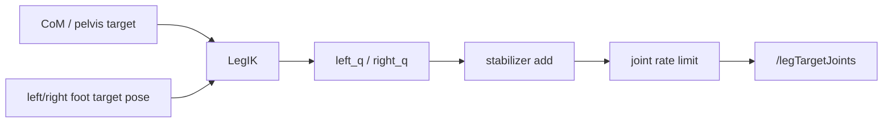

# Leg IK 技术详解

> [!summary]
> `leg_ik.py` 在当前 walker 里的职责是：
> **把骨盆目标位姿和左右脚目标位姿，解成左右腿各 6 个关节角。**

---

## 0. 本篇函数速查

| 函数 / 类 | 来源文件 | 本篇解释位置 | 相关跳转 |
|---|---|---|---|
| `LegIK.solve()` | `leg_ik.py` | [[leg_ik_notes#4. 先看核心代码|第 4 节]] | 上游：[[asimo_walker_code_reading_guide#8.5 第五步：在当前状态下，左右脚此刻应该在哪里|骨盆与双脚目标]] |
| `LegIK._solve_leg()` | `leg_ik.py` | [[leg_ik_notes#5. 它的计算思路怎么拆|第 5 节]] | 单腿 IK 的主要几何推导 |
| `LegIK.limit()` | `leg_ik.py` | [[leg_ik_notes#6. 关节限位在这个模块里也是核心组成部分|第 6 节]] | 下游还会经过 [[asimo_walker_code_reading_guide#8.9 第九步：并不是直接发布，还要过几道工程安全层|rate limit]] |
| `ZMPPreviewController.update()` | `zmp_preview.py` | [[com_planner_notes]] | 不是 IK 函数，但提供 pelvis 的 `x/y` |
| `SwingFootPlanner.pose()` | `swing_foot.py` | [[asimo_walker_code_reading_guide#8.6 第六步：摆动脚怎么在空中走|摆脚轨迹]] | 不是 IK 函数，但提供摆动脚 pose |
| `Stabilizer.compute()` | `stabilizer.py` | [[stabilizer_notes]] | IK 输出之后再叠加稳定补偿 |

---

## 1. 它在系统里的真正边界

在它之前，系统里流动的还是“位姿目标”：

- 骨盆应该在哪
- 左右脚应该在哪

在它之后，系统里流动的才变成“关节命令”：

- 左腿 6 个角
- 右腿 6 个角

所以它是整条 walking 链里最明确的一道边界：



---

## 2. 当前代码的关节约定

在当前实现里，每条腿 6 自由度，顺序是：

1. hip yaw
2. hip roll
3. hip pitch
4. knee pitch
5. ankle roll
6. ankle pitch

这一点在 IK 输出顺序里直接体现：

```python
q = [hip_yaw, hip_roll, hip_pitch, knee_pitch, ankle_roll, ankle_pitch]
```

---

## 3. IK 的输入是什么

接口：

```python
def solve(self, pelvis: Pose2D, left_foot: Pose2D, right_foot: Pose2D) -> tuple:
    return self._solve_leg(pelvis, left_foot, "left"), self._solve_leg(pelvis, right_foot, "right")
```

输入不是关节期望，而是：

- `pelvis`
  - `x, y, z`
  - `roll, pitch, yaw`
- `left_foot`
  - `x, y, z`
  - `roll, pitch, yaw`
- `right_foot`
  - `x, y, z`
  - `roll, pitch, yaw`

### 在主循环里这些输入怎么来的

```python
pelvis = Pose2D(com_x, com_y, self.params.pelvis_height, roll * 0.25, pitch * 0.25, pelvis_yaw)
left_q, right_q = self.ik.solve(pelvis, left_target_pose, right_target_pose)
```

也就是说：

- 骨盆平移来自 CoM planner
- 骨盆少量姿态倾斜来自 IMU 姿态
- 双脚目标来自“当前站住的脚位”或 swing planner

---

## 4. 先看核心代码

```python
def _solve_leg(self, pelvis: Pose2D, foot: Pose2D, side: str) -> list:
    side_sign = 1.0 if side == "left" else -1.0
    yaw_c = math.cos(pelvis.yaw)
    yaw_s = math.sin(pelvis.yaw)
    hip_lateral = side_sign * self.hip_width / 2.0
    hip_x = pelvis.x - yaw_s * hip_lateral
    hip_y = pelvis.y + yaw_c * hip_lateral
    hip_z = pelvis.z

    dx_world = foot.x - hip_x
    dy_world = foot.y - hip_y
    dx = yaw_c * dx_world + yaw_s * dy_world
    dy = -yaw_s * dx_world + yaw_c * dy_world
    dz = hip_z - foot.z
    sagittal = math.hypot(dx, dz)
    leg_len = clamp(math.hypot(sagittal, dy), 0.12, self.thigh_length + self.shin_length - 0.01)

    knee_cos = clamp(
        (self.thigh_length**2 + self.shin_length**2 - leg_len**2)
        / (2.0 * self.thigh_length * self.shin_length),
        -1.0,
        1.0,
    )
    knee_pitch = math.pi - math.acos(knee_cos)

    reach_cos = clamp(
        (self.thigh_length**2 + leg_len**2 - self.shin_length**2)
        / (2.0 * self.thigh_length * leg_len),
        -1.0,
        1.0,
    )
    reach = math.acos(reach_cos)
    line_angle = math.atan2(dx, max(0.04, dz))
    hip_pitch = line_angle - reach
    hip_roll = clamp(math.atan2(dy, max(0.08, dz)), -18.0 * D, 18.0 * D)
    hip_yaw = wrap_pi(foot.yaw - pelvis.yaw)

    ankle_pitch = foot.pitch - pelvis.pitch - hip_pitch - knee_pitch
    ankle_roll = foot.roll - pelvis.roll - hip_roll
    q = [hip_yaw, hip_roll, hip_pitch, knee_pitch, ankle_roll, ankle_pitch]
    return [clamp(q[i], self.limits[i][0], self.limits[i][1]) for i in range(LEG_DOF)]
```

---

## 5. 它的计算思路怎么拆

这段 IK 并不是数值优化式的，而是一个经典的几何 IK。

可以拆成 6 步。

---

### 5.1 先确定这条腿的髋关节位置

```python
side_sign = 1.0 if side == "left" else -1.0
hip_lateral = side_sign * self.hip_width / 2.0
hip_x = pelvis.x - yaw_s * hip_lateral
hip_y = pelvis.y + yaw_c * hip_lateral
hip_z = pelvis.z
```

### 这步的意思

骨盆中心不是左右腿真正的转动原点。

左右腿各自的髋关节，在骨盆中心两侧各偏：

$$
\pm \frac{\text{hip\_width}}{2}
$$

并且这个横向偏移要随骨盆 yaw 一起旋转到世界坐标里。

所以 IK 真正以：

```text
左髋 / 右髋
```

为每条腿的起点，而不是以骨盆中心为起点。

---

### 5.2 把脚相对髋的位置转回骨盆 yaw 坐标系

```python
dx_world = foot.x - hip_x
dy_world = foot.y - hip_y
dx = yaw_c * dx_world + yaw_s * dy_world
dy = -yaw_s * dx_world + yaw_c * dy_world
dz = hip_z - foot.z
```

这一步等价于把世界系中的脚相对位移，旋回到骨盆局部系里。

数学上可以理解成：

$$
\begin{bmatrix}
dx \\
dy
\end{bmatrix}
=
R(-\psi_{pelvis})
\begin{bmatrix}
dx_{world} \\
dy_{world}
\end{bmatrix}
$$

### 为什么要这样做

因为后面的腿几何解算，默认是在“以髋为根、以骨盆朝向为参考”的局部坐标系中做的。

---

### 5.3 先求腿长，再求膝角

```python
sagittal = math.hypot(dx, dz)
leg_len = clamp(math.hypot(sagittal, dy), 0.12, self.thigh_length + self.shin_length - 0.01)
```

腿总长度：

$$
L = \sqrt{dx^2 + dy^2 + dz^2}
$$

然后通过余弦定理解膝关节：

```python
knee_cos = (
    self.thigh_length**2 + self.shin_length**2 - leg_len**2
) / (2.0 * self.thigh_length * self.shin_length)
knee_pitch = math.pi - math.acos(knee_cos)
```

公式写成：

$$
\cos(\theta_k) =
\frac{l_1^2 + l_2^2 - L^2}{2 l_1 l_2}
$$

然后：

$$
\theta_k = \pi - \arccos(\cos(\theta_k))
$$

这里的 $\theta_k$ 就是膝 pitch。

> [!important]
> 这一步已经说明当前 IK 的骨干是标准二连杆腿几何。

---

### 5.4 再解髋 pitch

```python
reach_cos = (
    self.thigh_length**2 + leg_len**2 - self.shin_length**2
) / (2.0 * self.thigh_length * leg_len)
reach = math.acos(reach_cos)
line_angle = math.atan2(dx, max(0.04, dz))
hip_pitch = line_angle - reach
```

### 这一步的几何意义

在 sagittal 平面里：

- `line_angle` 是“髋到脚连线”的方向
- `reach` 是股骨相对于这条连线张开的角

于是：

$$
\theta_{hip,pitch} = \theta_{line} - \theta_{reach}
$$

也就是当前腿要向前摆多少，才能让脚到达目标位置。

---

### 5.5 髋 roll 和 hip yaw 怎么来

```python
hip_roll = clamp(math.atan2(dy, max(0.08, dz)), -18.0 * D, 18.0 * D)
hip_yaw = wrap_pi(foot.yaw - pelvis.yaw)
```

#### hip roll

这部分不是复杂 3D 优化解，而是一个很直接的侧向几何近似：

$$
\theta_{hip,roll} \approx \arctan\left(\frac{dy}{dz}\right)
$$

然后做限幅。

#### hip yaw

更简单，直接认为：

$$
\theta_{hip,yaw} = \text{wrap}(\psi_{foot} - \psi_{pelvis})
$$

也就是脚相对骨盆的 yaw 差值。

---

### 5.6 最后把脚姿态误差分配给踝关节

```python
ankle_pitch = foot.pitch - pelvis.pitch - hip_pitch - knee_pitch
ankle_roll = foot.roll - pelvis.roll - hip_roll
```

这一步的思路其实很直白：

- 髋和膝已经贡献了一部分腿的姿态
- 剩下需要让脚达到目标姿态的那部分，由踝去补

所以踝 pitch / roll 在当前实现里本质上是：

```text
足端姿态闭环补足项
```

---

## 6. 关节限位在这个模块里也是核心组成部分

当前 limits：

```python
self.limits = [
    (-30.0 * D, 30.0 * D),   # hip yaw
    (-22.0 * D, 22.0 * D),   # hip roll
    (-38.0 * D, 30.0 * D),   # hip pitch
    (0.0, 62.0 * D),         # knee pitch
    (-22.0 * D, 22.0 * D),   # ankle roll
    (-38.0 * D, 28.0 * D),   # ankle pitch
]
```

并且最终输出一定会走：

```python
return [clamp(q[i], self.limits[i][0], self.limits[i][1]) for i in range(LEG_DOF)]
```

### 这一点不能当附属细节看

在当前工程里，IK 不是“尽量精确到位”优先，而是：

> **在给定位姿目标下，尽量给出一个还在关节物理范围里的可执行解。**

这对 walking 来说非常关键，因为上层规划永远可能偶尔给出稍微激进的脚位。

---

## 7. 它和其他模块的接口关系

### 上游是谁

- `CoM planner`：给骨盆平移
- `main.py`：给骨盆少量 roll / pitch 倾斜
- `swing_foot`：给摆动脚连续轨迹
- `footstep_planner`：给最终落脚目标

### 下游是谁

- `stabilizer`：在 IK 输出关节角上叠加反馈补偿
- `_rate_limit`：再做单帧关节变化限速
- `/legTargetJoints`：最终发布

所以 IK 在系统里的真实位置是：

```text
上层几何 / 任务空间参考
-> IK
-> 下层关节执行参考
```

---

## 8. 这个实现的优点

### 8.1 足够直接

非常适合调试和讲解，不是黑盒。

### 8.2 运行成本低

每帧解算很快，不需要数值迭代求解器。

### 8.3 对当前 6 自由度腿模型够用

因为项目目标是保守 walking，不是复杂全身操作，几何 IK 已经很合适。

---

## 9. 这个实现的局限

### 9.1 不是全 6D 严格精确优化 IK

当前更偏几何近似，尤其在 roll / yaw 耦合上没有做更高级建模。

### 9.2 没有显式奇异位形处理

主要靠：

- `clamp`
- 腿长边界
- 关节限位

来兜住。

### 9.3 没有求“最佳”解，只求一个合理解

如果上层脚位目标太激进，结果通常表现为：

- 某些关节撞限位
- 脚位跟踪误差增大
- 步态变得僵

---

## 10. 调这个模块时最常见的现象解释

### 现象 1：腿总像伸不直或蹲太深

优先检查：

- `pelvis_height`
- `thigh_length / shin_length`
- 初始站姿与几何参数是否匹配

### 现象 2：转向时脚 yaw 看起来怪

优先检查：

- `turn_yaw_per_step`
- `hip_yaw` 限位
- `pelvis_yaw` 来源是否合理

### 现象 3：侧向摆动时脚踝翻得厉害

优先检查：

- `hip_roll` 与 `ankle_roll` 限位
- `support_zmp_margin`
- lateral CoM / ZMP 参考是否过激

---

## 11. 一句话收尾

当前 `leg_ik.py` 的本质就是：

> **用一套轻量的几何腿模型，把“骨盆和双脚此刻应该在哪里”翻译成左右腿 12 个可执行的关节角，并用关节限位保证输出不会过于离谱。**
