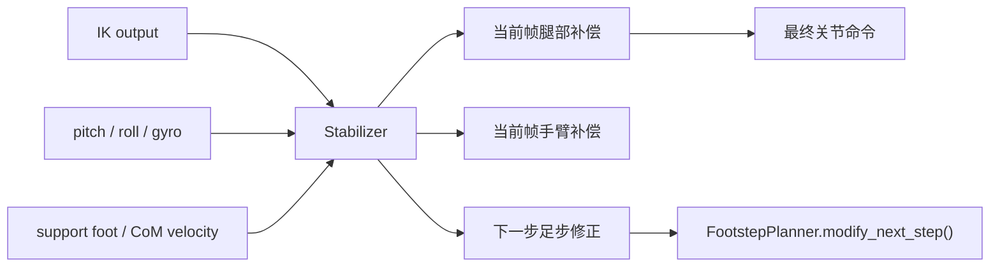

# Stabilizer 技术详解

> [!summary]
> `stabilizer.py` 是当前 walker 里最明确的反馈控制层。
>
> 它做两件事：
>
> 1. 根据 `pitch / roll / gyro` 给当前帧腿和手臂加补偿
> 2. 根据姿态与 CoM 速度，给下一步落脚点加保守修正

---

## 0. 本篇函数速查

| 函数 / 类 | 来源文件 | 本篇解释位置 | 相关跳转 |
|---|---|---|---|
| `Stabilizer.compute()` | `stabilizer.py` | [[stabilizer_notes#3. 先看当前代码|第 3 节]] | 上游：[[leg_ik_notes#4. 先看核心代码|IK 输出]] |
| `WalkerController._apply_next_step_adjustment()` | `main.py` | [[stabilizer_notes#8. 这个修正怎么真正进入足步规划|第 8 节]] | 把 `next_step_dx/dy` 写回 footstep planner |
| `FootstepPlanner.modify_next_step()` | `footstep_planner.py` | [[footstep_planner_notes#8. `modify_next_step()` 是这层最有意思的接口|足步修正接口]] | stabilizer 的下一步修正最终落在这里 |
| `WalkerController._rate_limit()` | `main.py` | [[asimo_walker_code_reading_guide#8.9 第九步：并不是直接发布，还要过几道工程安全层|rate limit]] | stabilizer 补偿后的关节命令仍会限速 |

---

## 1. 为什么这层重要

如果没有 stabilizer，当前 walking 控制链更接近：

```text
足步规划 -> ZMP 参考 -> CoM 跟踪 -> 摆脚轨迹 -> IK -> 发布
```

这条链已经能生成一条保守的参考步态，但它更偏“参考轨迹驱动”。

而 `stabilizer.py` 把它变成了：

```text
参考轨迹
+ 姿态反馈补偿
+ 下一步落脚反馈修正
```

所以它是整条链中最像“闭环稳定控制器”的部分。

---

## 2. 模块在主循环里的位置

主循环中的调用：

```python
stab = self.stabilizer.compute(
    pitch,
    roll,
    gyro,
    self.state_machine.support_foot(),
    com_vx,
    com_vy,
    len(self.left_arm_cmd),
    len(self.right_arm_cmd),
)
self.pending_step_adjustment = (stab.next_step_dx, stab.next_step_dy)

left_q = self.ik.limit([left_q[i] + stab.left_add[i] for i in range(LEG_DOF)])
right_q = self.ik.limit([right_q[i] + stab.right_add[i] for i in range(LEG_DOF)])
```

在系统中的位置可以画成：



---

## 3. 先看当前代码

```python
gyro_pitch = gyro[0] if len(gyro) > 0 else 0.0
gyro_roll = gyro[1] if len(gyro) > 1 else 0.0
pitch_fb = clamp(pitch + 0.09 * gyro_pitch, -10.0 * D, 10.0 * D)
roll_fb = clamp(roll + 0.09 * gyro_roll, -10.0 * D, 10.0 * D)

support_gain = 1.0
swing_gain = 0.25
if support_foot == "both":
    left_gain = 0.55
    right_gain = 0.55
else:
    left_gain = support_gain if support_foot == "left" else swing_gain
    right_gain = support_gain if support_foot == "right" else swing_gain

ankle_pitch = clamp(-p.ankle_pitch_kp * pitch_fb, -5.5 * D, 5.5 * D)
ankle_roll = clamp(-p.ankle_roll_kp * roll_fb, -5.0 * D, 5.0 * D)
hip_pitch = clamp(-p.hip_pitch_kp * pitch_fb, -3.5 * D, 3.5 * D)
hip_roll = clamp(-p.hip_roll_kp * roll_fb, -3.5 * D, 3.5 * D)

for add, gain in ((out.left_add, left_gain), (out.right_add, right_gain)):
    add[2] += gain * hip_pitch
    add[3] += gain * 0.35 * abs(hip_pitch)
    add[4] += gain * ankle_roll
    add[5] += gain * ankle_pitch
    add[1] += gain * hip_roll

arm = clamp(0.55 * pitch_fb, -8.0 * D, 8.0 * D)
side_arm = clamp(0.45 * roll_fb, -6.0 * D, 6.0 * D)
...
out.next_step_dx = clamp(0.08 * pitch + 0.12 * com_vx, -0.018, 0.018)
out.next_step_dy = clamp(0.06 * roll + 0.10 * com_vy, -0.014, 0.014)
```

---

## 4. 这段代码可以拆成三部分

### 4.1 先构造姿态反馈量

```python
pitch_fb = clamp(pitch + 0.09 * gyro_pitch, -10.0 * D, 10.0 * D)
roll_fb = clamp(roll + 0.09 * gyro_roll, -10.0 * D, 10.0 * D)
```

这说明 stabilizer 不是只看角度，也混入了一点角速度。

数学上可以写成：

$$
e_p = \text{clip}\left(pitch + 0.09\,\dot{pitch}\right)
$$

$$
e_r = \text{clip}\left(roll + 0.09\,\dot{roll}\right)
$$

更准确点说，它是一个很轻量的“姿态 + 角速度前馈/阻尼混合反馈量”。

### 为什么这样做

如果只看静态 pitch/roll：

- 身体已经在往某个方向倒，但角度还没很大时，反应可能偏慢

混入一点 gyro 后：

- 可以更早感受到“正在倒”的趋势

---

### 4.2 把反馈量映射到腿关节补偿

```python
ankle_pitch = clamp(-p.ankle_pitch_kp * pitch_fb, -5.5 * D, 5.5 * D)
ankle_roll = clamp(-p.ankle_roll_kp * roll_fb, -5.0 * D, 5.0 * D)
hip_pitch = clamp(-p.hip_pitch_kp * pitch_fb, -3.5 * D, 3.5 * D)
hip_roll = clamp(-p.hip_roll_kp * roll_fb, -3.5 * D, 3.5 * D)
```

### 当前控制律的直觉

如果 `pitch` 正向偏大，系统就给：

- ankle pitch
- hip pitch

一个反向修正。

如果 `roll` 正向偏大，系统就给：

- ankle roll
- hip roll

一个反向修正。

它的结构可以近似写成：

$$
\Delta q_{ankle,pitch} = -k_{ap}\,e_p
$$

$$
\Delta q_{ankle,roll} = -k_{ar}\,e_r
$$

$$
\Delta q_{hip,pitch} = -k_{hp}\,e_p
$$

$$
\Delta q_{hip,roll} = -k_{hr}\,e_r
$$

---

### 4.3 不同支撑相位，补偿强度不同

```python
support_gain = 1.0
swing_gain = 0.25
if support_foot == "both":
    left_gain = 0.55
    right_gain = 0.55
else:
    left_gain = support_gain if support_foot == "left" else swing_gain
    right_gain = support_gain if support_foot == "right" else swing_gain
```

### 这个设计非常关键

它告诉我们：

> 同样的姿态误差，支撑腿和摆动腿不应该承担一样的稳定任务。

当前代码的策略是：

- 双支撑：两边都给中等补偿
- 单脚支撑：支撑腿给大补偿，摆动腿给小补偿

这是非常符合 walking 物理直觉的：

- 真正能抗倒的是支撑腿
- 摆动腿如果补得太猛，会扰乱摆脚任务

---

## 5. 为什么膝关节也被轻微带动

看这行：

```python
add[3] += gain * 0.35 * abs(hip_pitch)
```

这里 `add[3]` 对应 knee pitch。

### 它的含义

当前 stabilizer 并没有对膝直接做独立 PD，而是：

- 当髋 pitch 需要补偿时
- 让膝也跟着一点点配合屈伸

这在工程上可以理解成：

```text
让整条腿链在 sagittal 平面里的补偿更像“整腿一起工作”
```

而不是只靠髋或只靠踝硬扛。

---

## 6. 手臂补偿不是装饰，它也是平衡的一部分

当前代码：

```python
arm = clamp(0.55 * pitch_fb, -8.0 * D, 8.0 * D)
side_arm = clamp(0.45 * roll_fb, -6.0 * D, 6.0 * D)
if out.left_arm_add:
    out.left_arm_add[0] += -arm
    if len(out.left_arm_add) > 1:
        out.left_arm_add[1] += side_arm
if out.right_arm_add:
    out.right_arm_add[0] += arm
    if len(out.right_arm_add) > 1:
        out.right_arm_add[1] += side_arm
```

### 控制意义

它让手臂在前后和侧向上做一点镜像摆动补偿。

严格说这不是完整上身动量补偿，但在工程上能提供：

- 更自然的上身响应
- 一点点辅助配平作用

所以当前系统不是“只稳腿，不管手臂”，而是把手臂当成了一个小辅助通道。

---

## 7. 最有价值的一层：下一步足步修正

代码：

```python
out.next_step_dx = clamp(0.08 * pitch + 0.12 * com_vx, -0.018, 0.018)
out.next_step_dy = clamp(0.06 * roll + 0.10 * com_vy, -0.014, 0.014)
```

### 这层不是当前关节补偿，而是“下一步策略修正”

物理直觉非常直接：

- 如果前后方向有扑倒趋势，下一步往前后多迈一点
- 如果左右方向有歪倒趋势，下一步往横向多撑一点

可以粗略写成：

$$
\Delta x_{step} = \text{clip}(0.08\,pitch + 0.12\,v_x)
$$

$$
\Delta y_{step} = \text{clip}(0.06\,roll + 0.10\,v_y)
$$

### 这和关节补偿的区别

- 关节补偿：救当前帧
- 足步修正：救下一步

所以 stabilizer 其实同时工作在两个时间尺度上：

```text
当前帧姿态修正
+ 下一步落脚修正
```

这是当前模块最值得你重视的设计点。

---

## 8. 这个修正怎么真正进入足步规划

主循环里先保存：

```python
self.pending_step_adjustment = (stab.next_step_dx, stab.next_step_dy)
```

然后在状态切换到双支撑后状态时应用：

```python
elif state in (WalkState.DOUBLE_SUPPORT_AFTER_LEFT, WalkState.DOUBLE_SUPPORT_AFTER_RIGHT):
    self._apply_next_step_adjustment()
```

内部：

```python
def _apply_next_step_adjustment(self) -> None:
    if not self.pending_step_adjustment:
        return
    dx, dy = self.pending_step_adjustment
    self.footsteps.modify_next_step(self.state_machine.step_index + 1, dx, dy)
    self.pending_step_adjustment = None
```

### 为什么不是立刻改当前步

因为当前步往往已经在 swing 或 touchdown 中了，直接改会打断当前轨迹一致性。

所以当前工程选择的是：

> **当前步靠关节补偿兜，下一步靠步点修正兜。**

这是很合理的时间分工。

---

## 9. 这个 stabilizer 的风格

从控制风格上看，它不是：

- 基于完整动力学模型的 whole-body controller
- 基于力矩分配的 QP stabilizer
- 基于 COP/ZMP 反馈的全状态控制器

它更像是：

> **一个保守的、结构化的、姿态反馈为主的工程稳定器。**

特点是：

- 逻辑透明
- 参数少
- 和当前 walking 链耦合清楚
- 调起来有很强的物理直觉

---

## 10. 当前实现的优点

### 10.1 结构清楚

你能明确知道每个反馈量作用到哪些关节。

### 10.2 很适合保守步态

它不会过度侵入上层 planner，而是做小幅修正。

### 10.3 同时兼顾当前帧和下一步

这比只补当前关节更有 walking 味道。

---

## 11. 当前实现的局限

### 11.1 没有显式用 COP 做更细反馈

虽然系统可以订阅足底力/COP，但 stabilizer 本身目前主要消费的是：

- IMU 姿态
- 角速度
- CoM 速度

### 11.2 补偿通道比较少

主要是：

- hip pitch / roll
- knee 一点联动
- ankle pitch / roll
- arm 辅助

没有更高级的上身、骨盆、接触力分配控制。

### 11.3 更偏启发式

例如：

- `0.09 * gyro`
- `0.35 * abs(hip_pitch)`
- `0.08 * pitch + 0.12 * com_vx`

这些都更偏工程经验型，而不是严格优化推导结果。

---

## 12. 调这个模块时最值得盯的参数

### `ankle_pitch_kp / ankle_roll_kp`

影响踝关节对姿态误差的第一反应强度。

### `hip_pitch_kp / hip_roll_kp`

影响髋关节参与平衡的力度。

### `max_joint_rate`

就算 stabilizer 算得很猛，最后还会被 rate limit 压住，所以这一项经常和 stabilizer 体感耦合。

### `max_com_speed / max_com_accel`

如果 CoM 本身太慢，stabilizer 往往会承担更多“救场任务”。

---

## 13. 现象到原因的直觉映射

### 现象 1：身体前后晃，脚踝像没接住

优先看：

- `ankle_pitch_kp`
- `zmp_kp / zmp_kd`
- `max_com_accel`

### 现象 2：左右切换时横摆明显

优先看：

- `ankle_roll_kp`
- `hip_roll_kp`
- `support_zmp_margin`
- `transfer_time`

### 现象 3：迈步时像在“追着摔”

优先看：

- `next_step_dx / next_step_dy` 的修正上限是否太小
- 上层步长是否过激
- CoM planner 是否太慢

---

## 14. 一句话收尾

当前 `stabilizer.py` 的技术本质就是：

> **用一个轻量姿态反馈层，在不破坏上层保守步态结构的前提下，同时修正“当前帧关节姿态”和“下一步落脚位置”，让 walker 从参考轨迹驱动变成真正有闭环味道的 walking 控制链。**
