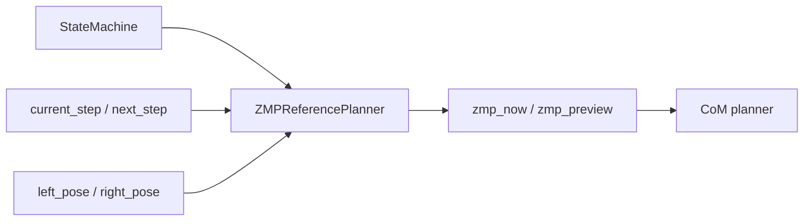
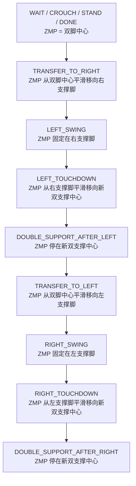

# ZMP Reference 技术详解

> [!summary]
> `zmp_reference.py` 在当前工程里并不是“完整的 ZMP 控制器”，而是：
> **按 walking 相位生成一个保守的支撑重心参考点。**

---

## 0. 本篇函数速查

| 函数 / 类 | 来源文件 | 本篇解释位置 | 相关跳转 |
|---|---|---|---|
| `ZMPReferencePlanner.zmp_for_state()` | `zmp_reference.py` | [[zmp_reference_notes#6. 数学上它在做什么|第 6 节]] | 上游：[[asimo_walker_code_reading_guide#8.3 第三步：当前 walking phase 下，ZMP 应该放哪里|主循环 ZMP 调用]] |
| `ZMPReferencePlanner.preview_zmp()` | `zmp_reference.py` | [[zmp_reference_notes#8. `preview_zmp()` 在当前实现里有多“preview”|第 8 节]] | 下游：[[com_planner_notes#4. 核心代码先贴出来|CoM update]] |
| `ZMPPreviewController.update()` | `zmp_preview.py` | [[com_planner_notes]] | 注意：它不在 `zmp_reference.py`，负责 CoM 平滑跟踪 |
| `ContactAndStateMachine.double_support_phase()` | `contact_state_machine.py` | [[asimo_walker_code_reading_guide#8.3 第三步：当前 walking phase 下，ZMP 应该放哪里|主线 8.3]] | 给 ZMP 过渡阶段提供相位 `u` |

---

## 1. 先说它在这套系统里到底负责什么

在当前 walker 里，`ZMPReferencePlanner` 解决的问题不是：

- 机器人真实 ZMP 的估计
- 基于力传感器的反演控制
- MPC 级别的预测优化

它解决的是更基础也更关键的问题：

> **当前处于哪一个步态相位时，身体重心“应该压向哪里”。**

这一步是 walking 看起来像 walking 的关键。

---

## 2. 它在主循环里的位置

主循环中的调用：

```python
zmp_phase = self.state_machine.double_support_phase()
if state in (WalkState.LEFT_TOUCHDOWN, WalkState.RIGHT_TOUCHDOWN):
    zmp_phase = min(1.0, self.state_machine.state_t / max(0.1, self.params.touchdown_time))

zmp_now = self.zmp_ref.zmp_for_state(
    state.name,
    current_step,
    zmp_phase,
    self.left_pose,
    self.right_pose,
)
zmp_preview = self.zmp_ref.preview_zmp(current_step, next_step)
if state in (WalkState.LEFT_SWING, WalkState.RIGHT_SWING):
    zmp_preview = zmp_now
```

所以在主链里，它的直接上下游是：



---

## 3. 当前代码里的核心思想

先看关键实现：

```python
if state_name == "TRANSFER_TO_RIGHT":
    return lerp(center_x, right_current.x, u), lerp(center_y, right_support_y, u)
if state_name == "TRANSFER_TO_LEFT":
    return lerp(center_x, left_current.x, u), lerp(center_y, left_support_y, u)
if state_name == "LEFT_SWING":
    return right_current.x, right_support_y
if state_name == "RIGHT_SWING":
    return left_current.x, left_support_y
if state_name == "LEFT_TOUCHDOWN":
    return lerp(right_current.x, left_landing_center_x, u), lerp(right_support_y, left_landing_center_y, u)
if state_name == "RIGHT_TOUCHDOWN":
    return lerp(left_current.x, right_landing_center_x, u), lerp(left_support_y, right_landing_center_y, u)
if state_name == "DOUBLE_SUPPORT_AFTER_LEFT":
    return left_landing_center_x, left_landing_center_y
if state_name == "DOUBLE_SUPPORT_AFTER_RIGHT":
    return right_landing_center_x, right_landing_center_y
```

### 这段代码的工程语义

它把 walking 明确拆成几个支撑阶段：

1. 双支撑中心
2. 向支撑脚转移
3. 单脚支撑
4. 落脚后回到新双支撑中心

这几乎就是传统双足 walking 最核心的节拍逻辑。

---

## 4. 先把几个几何量定义清楚

当前代码中会先构造这些参考点：

```python
center_x = 0.5 * (left_current.x + right_current.x)
center_y = 0.5 * (left_current.y + right_current.y)

left_support_y = left_current.y + self.params.support_zmp_margin
right_support_y = right_current.y - self.params.support_zmp_margin

left_landing_center_x = 0.5 * (step.left_target.x + right_current.x)
left_landing_center_y = 0.5 * (step.left_target.y + right_current.y)

right_landing_center_x = 0.5 * (left_current.x + step.right_target.x)
right_landing_center_y = 0.5 * (left_current.y + step.right_target.y)
```

### 它们分别代表什么

#### `center_x / center_y`

当前已站稳双脚的中点。

这对应：

```text
双支撑稳定时的“身体大致该在中间”的参考
```

#### `left_support_y / right_support_y`

不是直接把 ZMP 放到脚正中央，而是沿横向加一个小 margin。

这代表：

```text
单脚支撑时，给支撑脚一侧留一点保守支撑余量
```

#### `left_landing_center` / `right_landing_center`

落脚后，旧支撑脚和新落脚点构成的双支撑中点。

这代表：

```text
新脚着地以后，身体该回到“新的双脚中间”
```

---

## 5. 用状态图看当前 ZMP 参考切换



> [!important]
> 这个状态切换图，就是当前 walker “先移重心，再摆腿，再回中”的骨架。

---

## 6. 数学上它在做什么

### 6.1 双支撑转移阶段

以 `TRANSFER_TO_RIGHT` 为例，代码是：

```python
return lerp(center_x, right_current.x, u), lerp(center_y, right_support_y, u)
```

其中：

$$
u = \text{smoothstep}(\text{phase})
$$

于是：

$$
x_{zmp}(u) = (1-u)\,x_{center} + u\,x_{right}
$$

$$
y_{zmp}(u) = (1-u)\,y_{center} + u\,y_{right\_support}
$$

也就是：

> 从双脚中心，平滑地插值到右支撑脚参考点。

### 6.2 单脚支撑阶段

`LEFT_SWING` 时：

$$
ZMP = (x_{right}, y_{right\_support})
$$

`RIGHT_SWING` 时：

$$
ZMP = (x_{left}, y_{left\_support})
$$

也就是在单脚摆动时，ZMP 直接停在支撑脚。

### 6.3 落脚过渡阶段

以 `LEFT_TOUCHDOWN` 为例：

$$
x_{zmp}(u) = (1-u)\,x_{right} + u\,x_{landing\_center}
$$

$$
y_{zmp}(u) = (1-u)\,y_{right\_support} + u\,y_{landing\_center}
$$

意思就是：

> 新脚落地以后，重心不要猛然跳回双中，而是沿着 touchdown phase 平滑收回来。

---

## 7. `support_zmp_margin` 为什么重要

在代码里：

```python
left_support_y = left_current.y + self.params.support_zmp_margin
right_support_y = right_current.y - self.params.support_zmp_margin
```

这说明单脚支撑时参考点不是脚掌中点，而是沿横向做了一点偏置。

### 物理直觉

单脚支撑时，如果摆动脚抬得高、身体又偏慢，ZMP 太贴近中间会让横向稳定余量不够。

因此引入：

$$
\text{support\_zmp\_margin}
$$

等价于告诉系统：

```text
重心转移时，别只压到脚心，稍微更明确地压到支撑侧一点
```

### 调参影响

- 太小：单脚支撑可能不够果断，横向容易飘
- 太大：重心会压得过头，横向晃动变重

---

## 8. `preview_zmp()` 在当前实现里有多“preview”

当前代码：

```python
def preview_zmp(self, current: Footstep, next_step: Footstep = None) -> tuple:
    if next_step is None:
        pose = current.support_pose()
        return pose.x, pose.y
    pose = next_step.support_pose()
    return pose.x, pose.y
```

这个 preview 很保守，也很直接：

- 如果知道下一步，就返回下一步支撑脚位置
- 如果不知道下一步，就退回当前支撑脚位置

### 这不是什么

它不是完整 preview horizon 上的一串 ZMP 序列。

### 这是什么

它是一个轻量的“下一拍支撑趋势”提示量，交给后面的 CoM planner 做一点前瞻。

所以当前工程里的 ZMP preview 更像：

```text
current ZMP + one-step lookahead
```

而不是论文里长时域离散 preview 控制。

---

## 9. 为什么 walking 看起来不会立刻抬脚

因为当前架构中，摆脚前有两个强约束：

### 9.1 状态机先进入 transfer

状态机里：

```python
elif self.state == WalkState.TRANSFER_TO_RIGHT and self.state_t >= p.transfer_time and self._support_loaded(feedback, "right", stable):
    self._set(WalkState.LEFT_SWING)
```

也就是说，只有在：

- 转移时间到了
- 支撑侧加载足够
- 姿态仍稳定

才允许进 swing。

### 9.2 ZMP 在 transfer 阶段明确向支撑脚移动

因此：

```text
状态机先要求“允许移重心”
ZMP planner 再实际给出“往哪边移”
```

两层一起作用，结果就是“先把身体压过去，再抬另一只脚”。

---

## 10. 当前实现的优点

### 10.1 可解释性很强

每个状态下 ZMP 放在哪，代码几乎是一张明牌。

### 10.2 很适合保守双足步态

它天然偏向：

- 先转移
- 单脚支撑
- 落脚回中

这和当前项目目标高度一致。

### 10.3 与后续 CoM planner 解耦清晰

它只提供重心参考点，不直接操纵 CoM 状态变量。

---

## 11. 当前实现的局限

### 11.1 没有真实 ZMP 估计闭环

当前 `zmp_reference.py` 生成的是参考值，不是根据实时力/矩估算出来的实际 ZMP。

### 11.2 不是优化型 ZMP 规划

没有显式求解：

- 支撑多边形约束
- 更长时域的 preview horizon
- 动态可行性最优解

### 11.3 主要依赖相位而非真实接触形状

虽然状态机支持足底力比值判断，但 `zmp_reference.py` 本身不直接消费 COP 数据。

---

## 12. 如果你调这个模块，最该盯什么

### `support_zmp_margin`

影响单脚支撑时横向保守程度。

### `transfer_time`

不是 ZMP 模块内部参数，但直接决定 ZMP 从双中转到支撑脚的时间尺度。

### `touchdown_time`

决定从支撑脚回到新双支撑中心的过渡时长。

### `step_width`

会影响双支撑中心与支撑参考点的几何分布，所以也会影响 ZMP 转移幅度。

---

## 13. 一句话收尾

`zmp_reference.py` 的本质不是“复杂的 ZMP 控制算法”，而是：

> **把 walking 相位翻译成一条保守、可解释的支撑重心参考轨迹，让系统先学会在对的相位把重量压到对的地方。**
